# 翻墙

## 介绍
    现在，翻墙了解更多国外的内容已经是很多人都掌握的技能，为了方便更多人了解和学习更多国外的知识，在这我准备了
    一份完整的翻墙教程。在真正学会翻墙之前，我们需要了解一下翻墙的原理。如下图

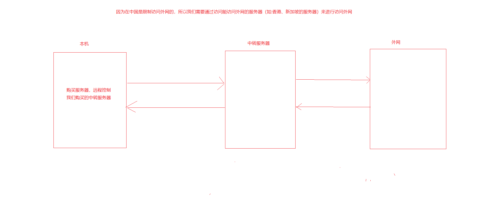

## linux命令
    * 在学会翻墙之前我们需要了解一下几个简单的linux命令
        1. reboot 重启服务器

        2. service 软件名 status：查看服务命令

        3. service 软件名 start：启动服务

        4. service 软件名 stop：停止服务

        5. service 软件名 restart：重启服务

        6. ls：列出目录

        7. cat：显示文件详细内容

## 实现翻墙的步骤
    1. 首先我们要在阿里云中购买一个服务器（香港），在这里具体如何购买就不再介绍了，下面介绍了一下主要的选择

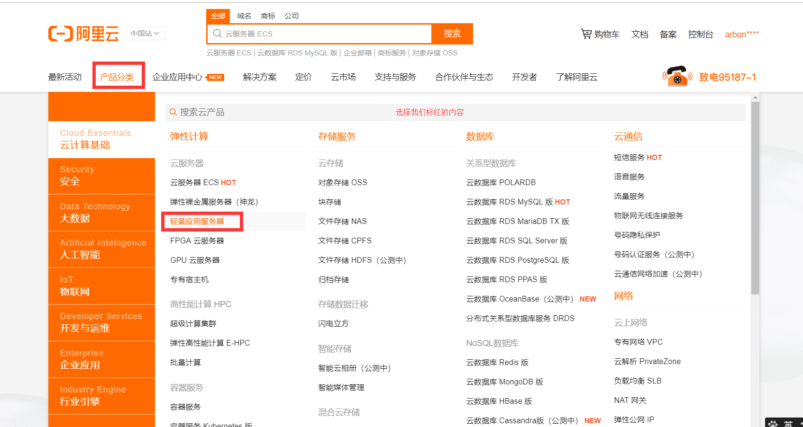

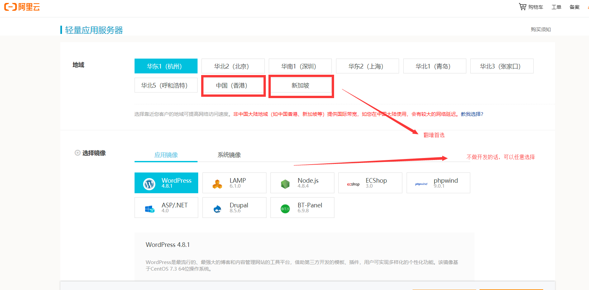

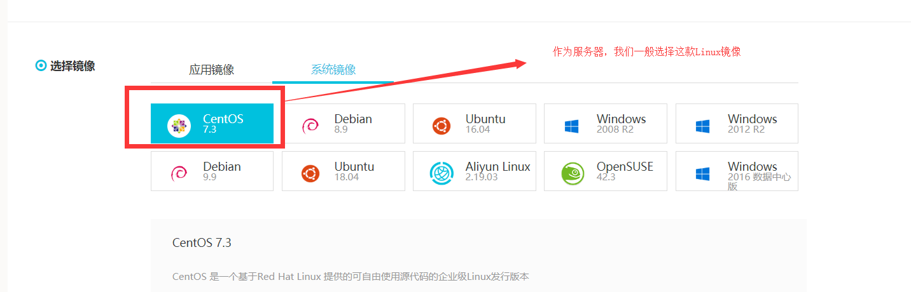

        * 在我们完成购买之后看到如下页面

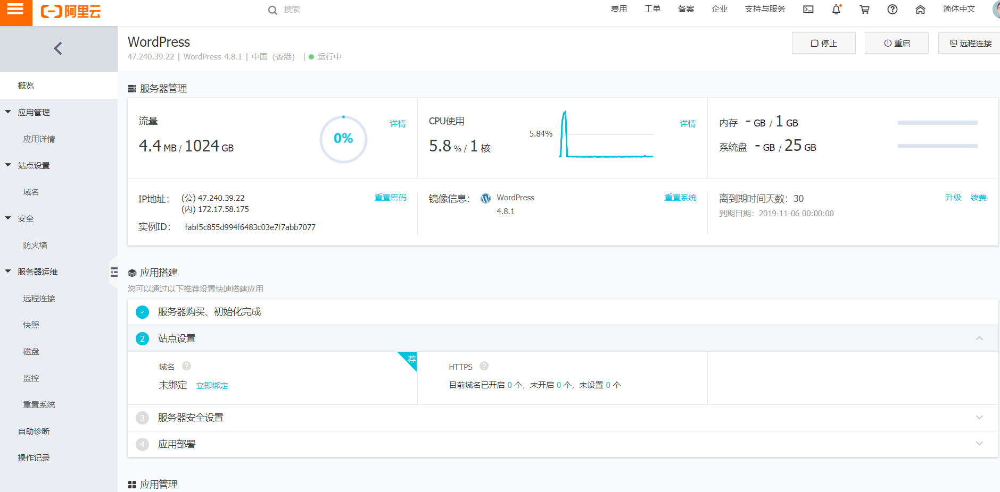

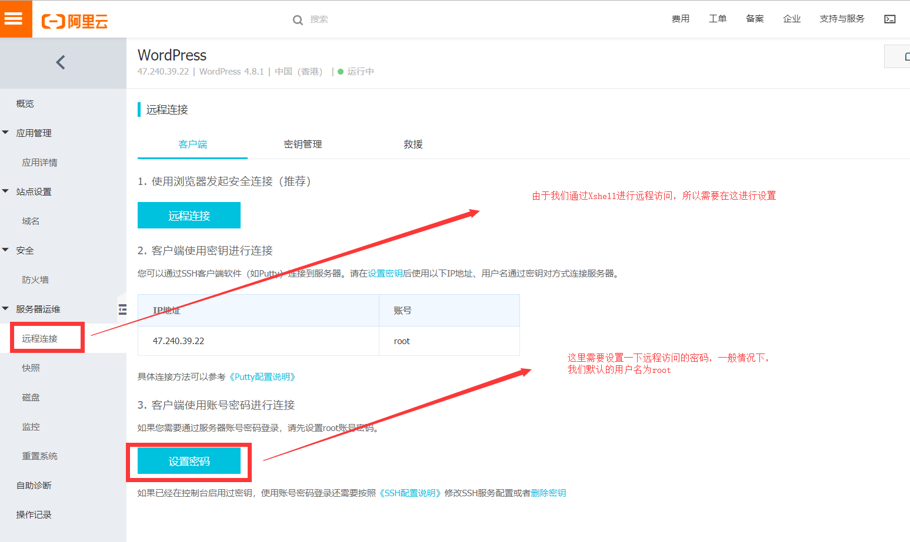

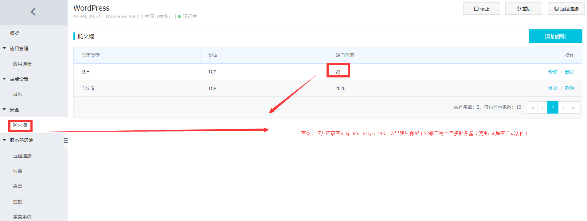

    2. 然后我们需要去下载Xshell，可以直接在百度中进行搜索下载即可

    3. 在安装好Xshell之后，我们需要找到我们服务器的地址，如下

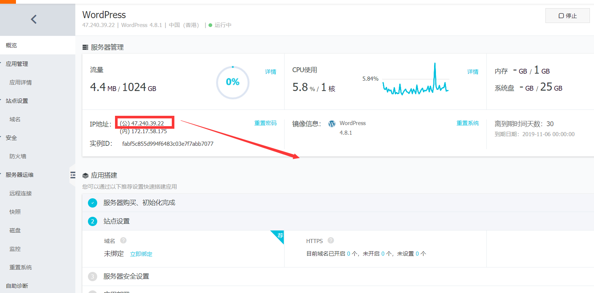

    4. 接下利用XShell远程访问我们购买的服务器，如下：

        <1> 首先，我们首次打开XShell的页面如下

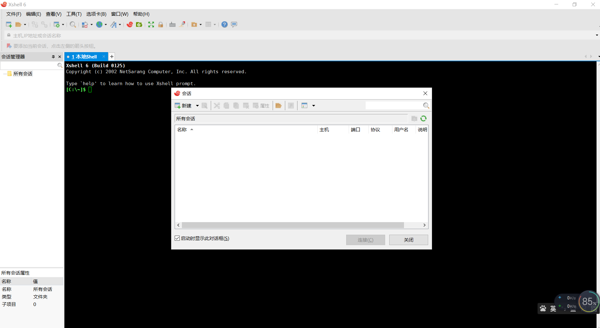

        <2> 接下来,我们点击添加与服务器进行链接

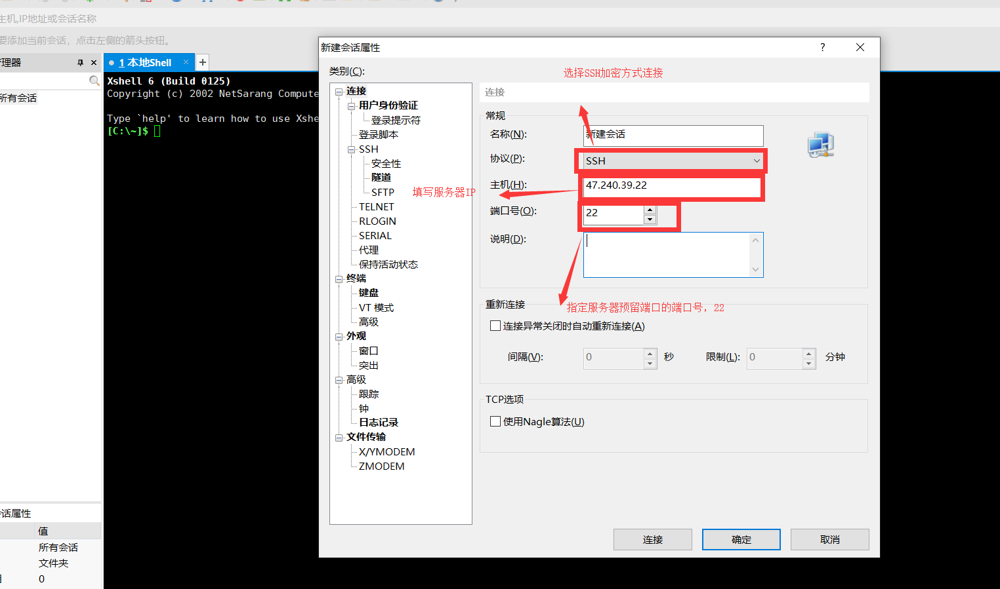

        <3> 点击确定后出现下面页面，选中选项，点击链接，如图

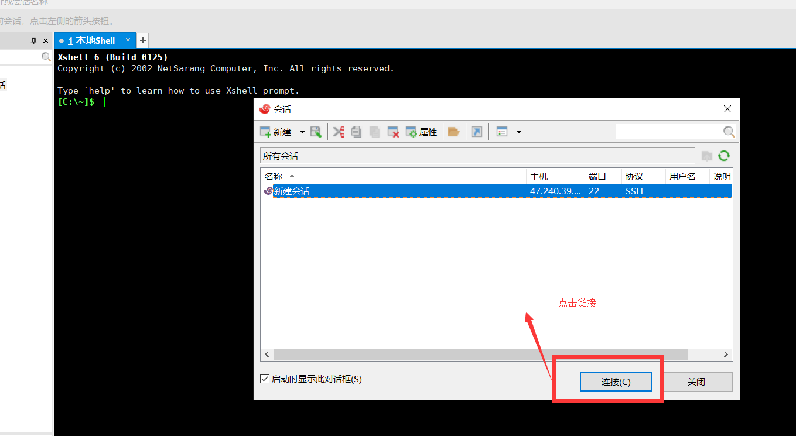

        <4> 出现如下页面，填写用户名和密码，如下

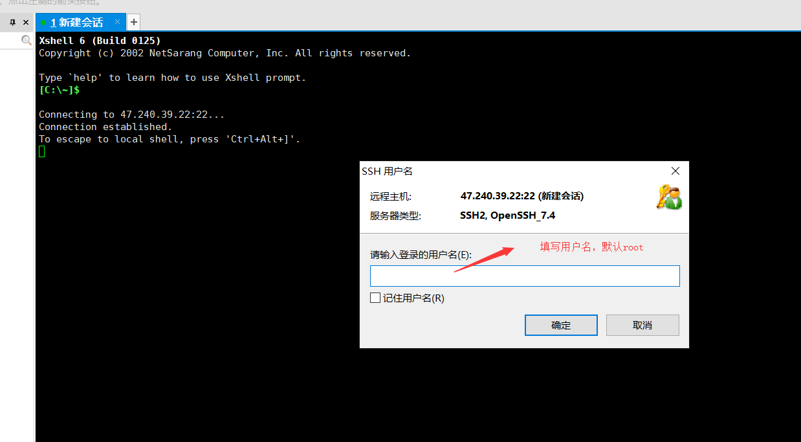

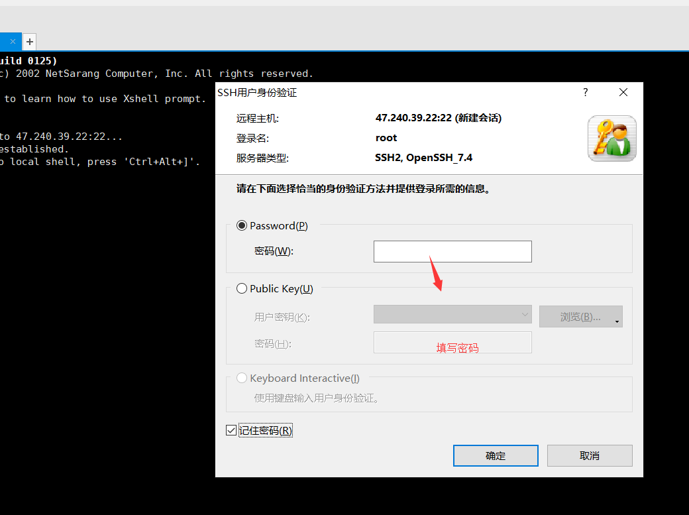

        <5> 连接成功后，如下

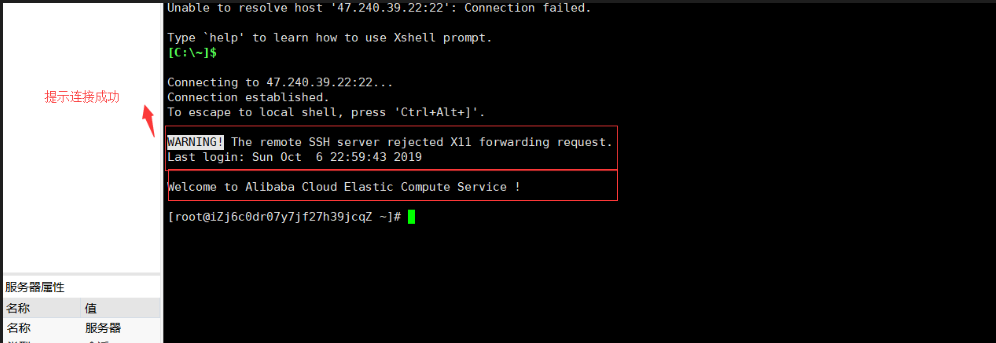

    5. 在正式搭建之前我们需要在本机电脑首先下载并安装好shadowsocks（可以访问github官网直接搜索后进行下载），参数先忽略

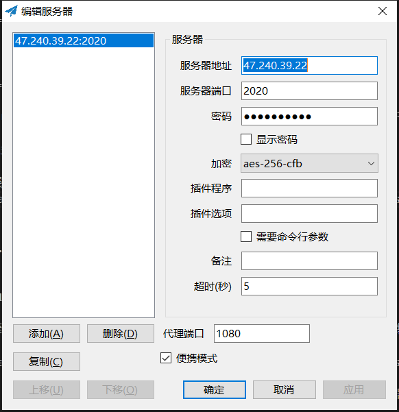

    6. 那么，接下来我们就需要进行正式的搭建，也就是在XShell中对服务器进行操作

        <1> 连接到服务器后输入下面的命令拉取shadowsocks安装脚本文件
            wget --no-check-certificate -O shadowsocks-all.sh 脚本地址（在github中提供的shadowsocks）

        <2> 将其变为执行文件
            chmod +x shadowsocks-all.sh

        <3> 执行安装文件
            ./shadowsocks-all.sh 2>&1 | tee shadowsocks-all.log

        <4> 运行完最后的命令行后，会看到一个选项：Which Shadowsocks server you’d select，因为我们要安装ShadowsocksR，
            就选择ShadowsocksR对应的数字。

        <5> 然后会看到“Please enter password for ShadowsocksR”，这时需要设定一个以后翻墙时连接Shadowsocks的密码，请
            自行设定。

        <6> 下一个选项”Please enter a port for ShadowsocksR [1-65535]”是让选择一个Shadowsocks的服务器端口，建议使
            用：443。

        <7> 接下来的选项“Please select stream cipher for ShadowsocksR”，是让选择加密方式，建议选择：chacha20-ietf。

        <8> 下一个选项“Please select protocol for ShadowsocksR”，是让选择协议，建议选择：origin。

        <9> 下一个选项“Please select obfs for ShadowsocksR”，是让选择混淆模式，建议选择：http_simple_compatible。

        <10> 然后出现的指示“Press any key to start…or Press Ctrl+C to cancel”，意思是按任何键开始安装或按“Ctrl+C”
             取消安装。这时按回车键，就可以开始安装了.安装过程可能需要一段时间，请耐心等待。

        <11> 补充：
            * 修改shadowsocks配置:
              vi /etc/shadowsocks-r/config.json

            * 每次更改完设置后，需要运行以下命令行重启ShadowsocksR:
              /etc/init.d/shadowsocks-r restart

